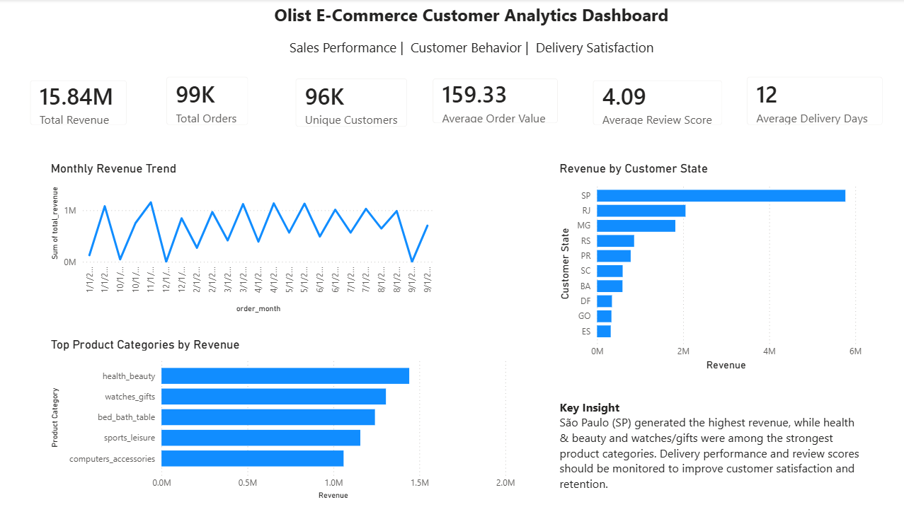
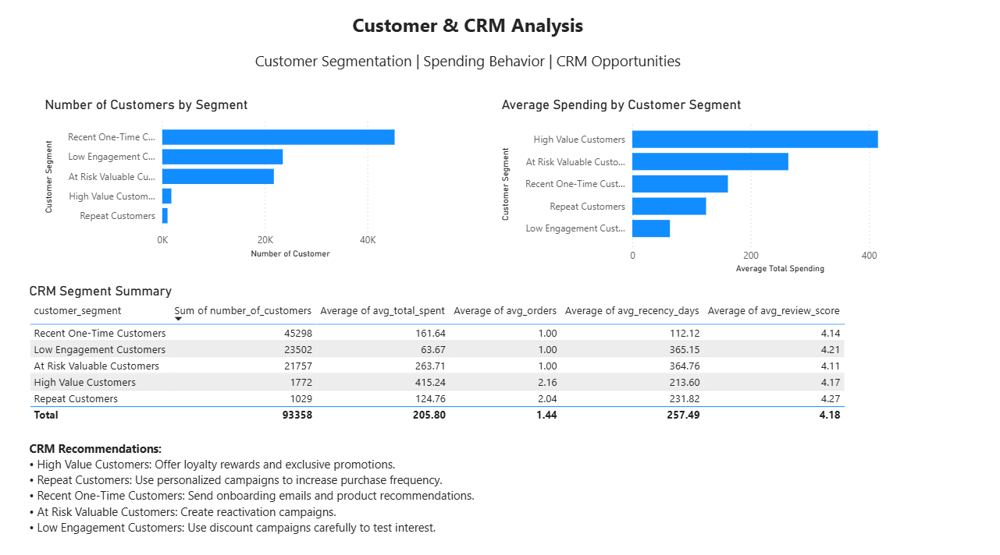
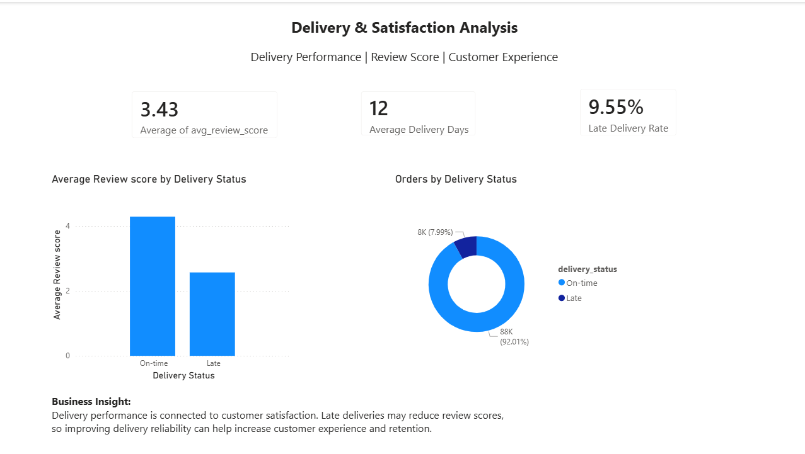

# Olist E-Commerce Customer Analytics

## Project Overview

This project is an end-to-end e-commerce analytics portfolio project using **SQL, Python, and Power BI**.
I analyzed the Olist Brazilian E-Commerce dataset to understand sales performance, customer behavior, product category performance, delivery experience, and customer satisfaction.

The project demonstrates a practical data analytics workflow:

**Raw CSV Data → Python Cleaning → SQLite SQL Analysis → Processed Data Export → Power BI Dashboard → Business Insights**

---

## Project Objective

The main goal of this project is to answer business questions such as:

* Which product categories generate the highest revenue?
* Which customer states contribute the most sales?
* How does revenue change over time?
* How do delivery delays affect customer review scores?
* How can customers be segmented for CRM and retention strategies?

---

## Tools Used

* **Python**: data loading, cleaning, preprocessing, and customer segmentation
* **Pandas / NumPy**: data manipulation and transformation
* **SQLite / SQL**: business queries and database analysis
* **Power BI**: dashboard creation and visualization
* **Matplotlib**: basic chart visualization
* **GitHub**: project documentation and portfolio sharing

---

## Dataset

Dataset: **Brazilian E-Commerce Public Dataset by Olist**

The dataset includes customer, order, product, payment, delivery, and review information from a Brazilian e-commerce platform.

Main tables used:

* `customers`
* `orders`
* `order_items`
* `payments`
* `reviews`
* `products`
* `category_translation`

Raw dataset files are not included in this repository. They can be downloaded from Kaggle and placed in:

```text
data/raw/
```

---

## Project Workflow

### 1. Data Loading and Cleaning with Python

The raw CSV files were loaded into Python using pandas.
Basic data checks were performed, including:

* dataset shape checking
* missing value checking
* duplicate checking
* date column conversion
* delivery time calculation
* revenue calculation
* customer-level data preparation

### 2. SQL Business Analysis

A SQLite database was created from the cleaned data tables.
SQL queries were used to analyze:

* monthly sales trend
* revenue by customer state
* top product categories
* payment behavior
* delivery performance
* customer review scores
* repeat customer behavior
* RFM base table for customer segmentation

### 3. Customer Segmentation

Customers were segmented using a simple CRM-focused approach based on:

* total spending
* number of orders
* recency of purchase
* review behavior

Customer groups included:

* High Value Customers
* Repeat Customers
* Recent One-Time Customers
* At Risk Valuable Customers
* Low Engagement Customers

### 4. Power BI Dashboard

Processed CSV files were exported from Python and imported into Power BI.
The Power BI dashboard includes three pages:

1. **Executive Overview**
2. **Customer & CRM Analysis**
3. **Delivery & Satisfaction Analysis**

---

## Dashboard Preview

### Executive Overview



### Customer & CRM Analysis



### Delivery & Satisfaction Analysis



---

## Key Business Insights

* Revenue and order volume can be monitored monthly to understand business performance trends.
* A small group of product categories contributes strongly to total revenue.
* Some customer states generate significantly higher revenue, suggesting priority markets for marketing campaigns.
* Delivery performance is connected to customer satisfaction, as late deliveries tend to receive lower review scores.
* CRM segmentation can help the business design different strategies for high-value, repeat, recent, at-risk, and low-engagement customers.

---

## Business Recommendations

* Focus marketing campaigns on high-revenue product categories and high-performing customer states.
* Use CRM segmentation to create targeted campaigns for different customer groups.
* Offer loyalty rewards or exclusive promotions to high-value and repeat customers.
* Create reactivation campaigns for at-risk valuable customers.
* Monitor delivery delays because improving delivery reliability can support better customer satisfaction and retention.

---

## Repository Structure

```text
olist-customer-analytics/
│
├── data/
│   └── README.md
│
├── sql/
│   ├── 00_create_tables_sqlite.sql
│   └── 01_business_analysis_queries.sql
│
├── python/
│   └── olist_customer_analytics.ipynb
│
├── powerbi/
│   └── olist_customer_analytics_dashboard.pbix
│
├── images/
│   ├── executive_overview.png
│   ├── customer_crm_analysis.png
│   └── delivery_satisfaction.png
│
├── requirements.txt
├── .gitignore
└── README.md
```

---

## Skills Demonstrated

* Data cleaning and preprocessing
* SQL joins, aggregations, filtering, CTEs, and business queries
* Python data analysis using pandas
* Customer segmentation for CRM analysis
* Power BI dashboard design
* Business insight generation
* Data storytelling for decision-making

---

## Author

**Nyein Nyein Kyaw**

Digital Technology for Business Innovation Student

Mae Fah Luang University

Interest Areas: Data Analytics, Business Analytics, Marketing Analytics, CRM, and AI-driven Research
